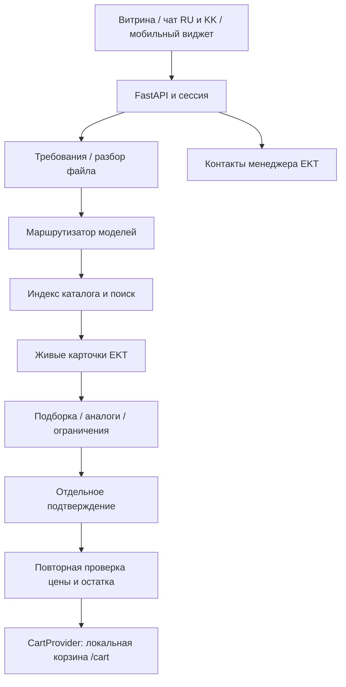

# EKT AI Engineer · HackAlem MVP

Консультант и помощник закупщика для **ekt.kz**: от запроса или спецификации до проверенной подборки и подтверждённой локальной корзины. Интерфейс работает на русском и казахском, на компьютере и телефоне.

Репозиторий: [BAITC-Hacks/hack-40c312ea-solution](https://github.com/BAITC-Hacks/hack-40c312ea-solution), основная ветка **main**. Публичная развёрнутая версия пока не опубликована. После запуска: **http://127.0.0.1:8000** — ссылка работает на компьютере с запущенным сервером.

## Быстрый запуск для организаторов — без ключей

Требуется Python **3.11+**. Скачайте ZIP ветки `main` и распакуйте либо клонируйте репозиторий с доступом к BAITC-Hacks. Выполняйте команды в папке с `run.py` и `requirements.txt`.

```bash
python -m venv .venv
```

Windows PowerShell:

```powershell
.\.venv\Scripts\python.exe -m pip install -r requirements.txt
.\.venv\Scripts\python.exe run.py --demo
```

macOS / Linux:

```bash
.venv/bin/python -m pip install -r requirements.txt
.venv/bin/python run.py --demo
```

Откройте **http://127.0.0.1:8000**. `--demo` использует явно подписанные вымышленные товары `DEMO`, не вызывает EKT и платные модели. Доступны каталог, поиск, русский/казахский чат, текстовые файлы, подтверждение количества и локальная корзина. Фото требуют vision-модели в live-режиме. `python run.py` тоже включает демо, если пароль EKT отсутствует или равен `replace_me`.

## Реальный каталог EKT

1. Скопируйте `.env.example` в `.env`.
2. Укажите выданные партнёром `EKT_USER`, `EKT_PASSWORD` и `DEMO_MODE=0`.
3. Запустите `python run.py` из созданного окружения.
4. При первом запуске дождитесь синхронизации. Поиск по ID доступен сразу; последующие запуски используют локальный индекс. Цены и остатки выбранных товаров читаются из API заново.

Ключи и пароли не включены в репозиторий. Для проверки со смартфона в доверенной общей сети можно запустить `python run.py --host 0.0.0.0` и открыть адрес компьютера. Для публикации нужен HTTPS-хостинг.

## Реализованные возможности

- Каталог с изображениями, ID/артикулом, поиском, категориями и страницами; живые цена/остаток; карточки с характеристиками, складами и сертификатом, если API предоставляет ссылку.
- Русский и казахский интерфейс и ответы, контекст текущего товара, условия оплаты/доставки, уточнение параметров. Исходные названия и характеристики сохраняются как в каталоге.
- Аналоги отсутствующих товаров по известному назначению, току и полюсам с объяснением; при нехватке данных — уточнение и менеджер.
- Предварительный комплект для сложной задачи; режимы «Дешевле», «В наличии», «Лучшее совпадение», предпочтительный бренд через диалог. Совместимость без достаточных данных не гарантируется.
- CSV, XLS/XLSX, DOCX, текстовый PDF, JPG/JPEG/PNG, первая страница сканированного PDF. Предпросмотр и исправление распознанных строк/количеств перед подбором. Отдельное согласие на передачу изображения ИИ.
- Локальная корзина: добавление, изменение и удаление только после отдельного подтверждения. Повторно проверяются цена, остаток, выбранный склад и кратность. Токен привязан к сессии и действует 120 секунд; повторное использование не добавляет товар снова.
- Прямая ссылка **`/cart`** открывает текущее содержимое локальной корзины в той же вкладке/сессии. Заказ не отправляется и товар не резервируется.
- Реальные `tel:`, WhatsApp и email менеджера EKT с официального сайта. Пользователь сам звонит/отправляет сообщение; история автоматически не передаётся. Старый API демозаявки сохранён, CRM не подключена.
- Полноэкранный мобильный чат, адаптивные карточки и окна подтверждения, история текущей анонимной сессии, очистка данных и отказ от дополнительных рекомендаций.
- Встраиваемый виджет, проверка источника запросов, изоляция сессий и обработка документов в ограниченном дочернем процессе.

## Пример проверки

В деморежиме откройте товар **900005**, укажите **2** единицы и нажмите добавление. До отдельного подтверждения корзина пуста; после него `/cart` содержит 2 единицы. Превышение остатка отклоняется.

В чате: `900005` → `добавь 2 в корзину` → отдельное `да, добавь`. На казахском: `Маған 900005 керек` → `себетке 2 қос` → `иә, қос`. Загрузите `examples/demo_spec.csv`, проверьте количества и подтвердите подбор: загрузка сама не меняет корзину. Кнопка «Менеджер» показывает действительные контакты, для теста звонить не нужно. `/embed-demo` демонстрирует виджет.

В live-режиме: **33723** — пример Schneider; **515291** — пример противоречия 160/250 A в исходных данных, которое вызывает предупреждение. Запросы: `автомат Schneider 3P 32A`, `сделай дешевле`, `Нужно собрать защиту двигателя 11 кВт, 380 В`. Цены и остатки меняются; числа из скриншотов не являются тестовой фикстурой.

## Технологии и архитектура

Python, FastAPI/Pydantic, HTTPX, RapidFuzz; обычные HTML/CSS/JavaScript без сборщика frontend. Для файлов: openpyxl, xlrd, python-docx, PyMuPDF, Pillow. Сессии в памяти и локальный JSON-индекс.



Папки: `app/` — API, агент, провайдеры, парсеры и безопасность; `static/` — витрина/чат/виджет; `tests/` — автономные проверки; `examples/` — спецификация; `docs/` — интеграция; `qa/` — отчёты команды. `run.py` — единая точка запуска. Маршруты: `/`, `/cart`, `/engine` (исходный интерфейс), `/embed-demo`, `/openapi.json` (описание API), `/api/integration`.

## Данные, модели и внешние сервисы

EKT: `https://ekt.kz/api/products?page=N`, `https://ekt.kz/api/products/detail?id=ID`; BasicAuth только на сервере. Схема: `id`, `article`, `name`, `price`, `image`, `url`; detail добавляет `quantity`, `stores`, `properties`, `description`. Каталог читается до повторения первой страницы или заданного лимита. [Условия покупки](https://ekt.kz/about/information/) и [контакты](https://ekt.kz/about/contacts/) проверены 23.09.2026. Индивидуальный ETA и общая минимальная сумма заказа не выдумываются.

OpenAI/NVIDIA опциональны: `OPENAI_API_KEY`, `NVIDIA_API_KEY`; `CHEAP_MODEL`, `MEDIUM_MODEL`, `STRONG_MODEL`, `VISION_MODEL` и `*_PROVIDER` задаются в `.env`. В текущем окружении проверены `gpt-6-luna`, `gpt-5.4-mini`, `gpt-6-sol`; доступность зависит от аккаунта. NVIDIA без ключа не тестировалась.

`DIRECT` — точный ID/артикул, условия, корзина без модели. `CHEAP` — короткий запрос; `MEDIUM` — сравнительный; `STRONG` — сложный комплект; `VISION` — изображение. Весь каталог в модель не передаётся. Если провайдер недоступен, текстовый поиск продолжает работать с явным fallback. `MAX_MODEL_CALLS` и `MODEL_SPEND_LIMIT_USD` ограничивают использование; `model_usage.json` содержит оценку, а не выписку биллинга. Для неизвестных моделей стоимость может быть не определена.

## Проверки

Обновление достоверности и скорости: [qa/grounding-report.md](qa/grounding-report.md). Актуальный набор: **88 тестов**. Модель сравнивает реальные карточки и выбирает подтверждающие поля; сервер проверяет ID/поля и сам рассчитывает разницу цен. Добавлены «подороже», предложения дополнений после подтверждения, помощь менеджера при отсутствии фактов и общий предел 18 секунд для обычного ответа. Неизвестный ETA не заменяется обещанием доставки.

```bash
python -m unittest discover -s tests -v
python tests/test_agent_behavior.py
```

Первый набор проверяет актуальное поведение. Второй сохраняет исходные ожидания QA: интеграция с удалённой корзиной EKT остаётся незакрытой, а его JPEG-фикстура содержит некорректные байты и отклоняется новой проверкой файла. Подробности — `qa/acceptance-report.md`; исходные отчёты команды сохранены.

## Совместимость и известные ограничения

См. [docs/INTEGRATION.md](docs/INTEGRATION.md). На сайте наблюдаются ресурсы `/bitrix/`. Виджет подключается одним script; backend можно разместить отдельно или за reverse proxy. Проверка в шаблоне и cookie-сессии EKT требует доступа партнёра.

**Штатная корзина и внутренняя БД EKT не подключены.** Выданный API даёт чтение каталога. `CartProvider` изолирует локальную реализацию; EKT должен предоставить разрешённый контракт корзины, связь с посетителем и тестовый контур. Официальная ссылка не переносит локальные позиции. Требование полноценного оформления на ekt.kz пока реализовано только на уровне локального прототипа.

Сессии живут в памяти до 30 минут бездействия и теряются при перезапуске; запускайте MVP одним процессом. История авторизованных пользователей и CRM не подключены. Файл — до 10 МБ/12 строк; скан PDF — первая страница. Электрическая совместимость предварительная. Если подходящего аналога с подтверждёнными свойствами нет, замена не гарантируется. Задержка зависит от EKT и ИИ, сложный комплект может занимать больше нескольких секунд.

История сохраняет коммит **DamiMura / Damitov Murat** `c6dd771` и QA-коммиты **ent1tyyyy**. Репозиторий приватный внутри BAITC-Hacks: организаторам нужны права на него; для автономного демо секреты не требуются.


## Проверка презентационного сценария (23 сентября)

1. Открыть чат: «мне нужны лампы для кафешки».
2. Включить **ДЕМО доставки** и выбрать город (Алматы / Астана / Шымкент / Караганда).
3. «Мне нужны максимально дешевые варианты и чтобы доставка в Алмату была в быстрый срок».
4. «Добавь самую первую лампу мне в корзину» → проверить состав → «да, добавь».
5. В корзине изменить количество → «Изменить» → проверить переход `1 → 3` → подтвердить. Обновлённая корзина открывается автоматически.

`DEMO_LOGISTICS=1` включает виртуальную логистику по умолчанию; в `.env.example` она выключена. Переключатель действует в текущей сессии. Демосроки и виртуальные остатки по городам не являются данными EKT, показываются отдельно и **не используются для проверки допустимого количества в корзине**. При запросе скорости сортировка: допустимые товары в реальном наличии → меньший демосрок → меньшая цена. При выключенном режиме индивидуальные сроки не обещаются.

Фотографии корзины берутся из API. Категории имеют отдельное состояние выбора, фильтр действует и на поиск. Названия моделей и провайдеров в клиентском интерфейсе скрыты; технические маршруты остаются в диагностических ответах API. Сертификаты показываются только при наличии ссылки в данных; поддерживаются вложенные поля и относительные ссылки EKT. В проверенной выборке 23 товаров сертификатов API не предоставил — доступен запрос менеджеру, документы не подделываются.

Актуальная проверка: [qa/presentation-report.md](qa/presentation-report.md).


### Разбор свободного текста и заказа ИИ

Подключённая модель нормализует запрос клиента, затем сравнивает реальные карточки и выбирает подтверждённые характеристики для объяснения. Для выбора из показанного списка отдельный короткий ИИ-вызов извлекает товар и количество: например, «беру пару из второго варианта» формирует предпросмотр двух штук второй позиции. Модель не имеет операции подтверждения: добавление выполняется только после отдельного согласия пользователя, повторной проверки цены/остатка и проверки серверного токена. Неизвестные ID, неправильные количества и несоответствие категории отбрасываются.

Простые точные запросы и подтверждения обходятся без модели. При недоступности провайдера сохраняется ограниченный поиск по каталогу и явным командам. Нормализация разговорных названий (лампочки, розеточки, проводочки, кабельки, автоматики) работает и без ИИ; она не заменяет технические параметры. Отказ от покупки распознаётся как целое высказывание, поэтому «мне нужно» больше не совпадает с «не нужно».

Регрессии и реальные замеры: [qa/semantic-dialog-report.md](qa/semantic-dialog-report.md).
